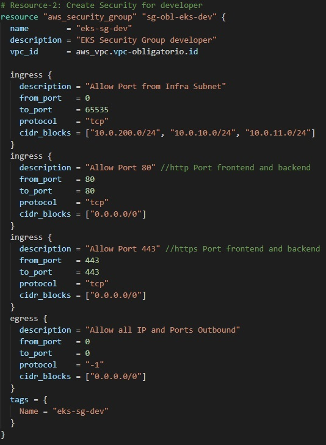
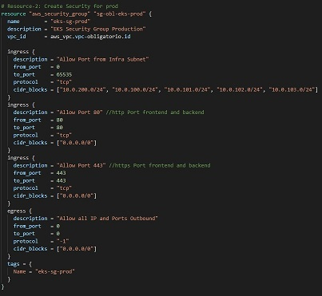
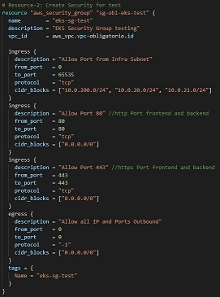
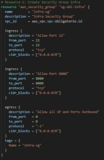

# Obligatorio Certificacion DevOps :rocket:

Integrantes del equipo: [Jorge González  ](https://github.com/jorgon183)[, Aroldo Navarro  ](https://github.com/aroldonq)[, Federico Mastrángelo](https://github.com/2matra2/)

## Implementacion modelo DevOps

Que es DevOps:interrobang:

DevOps en escencia son un conjunto de metodologias y practicas que agrupan el desarrollo
de software y  la operaciones TI, destinadas a agilizar el ciclo de vida del desarrollo de 
software proporcionando una alta calidad en la entrega continua del mismo. DevOps busca
la entrega de funcionalidades al usuario lo mas rapido posible sin sacrificar la calidad del 
producto.


**La implementacion de este obligatorio consta de 3 Puntos clave:**

- **La utilizacion de un repositorio para versionado y gestion de codigo.**
- **La creacion de la Infraestructura Como Codigo.**
- **La implementacion de un canal CI/CD.**


## IaC:computer:

Para la creacion de la infraestructura cloud se utilizara la herramienta de aprovisionamiento de infraestructura *Terraform*, junto con el proveedor **Amazon Web Services** en el cual se desplegarán clusters de *Kubernetes* utilizando el servicio **EKS** (Elastic Kubernetes Service)

Los archivos de el proyecto son manejados en el siguiente repositorio:
[Repo Terraform](https://github.com/devopsort/terraform.git)  (En la rama "Prod").


**Antes de iniciar se debe crearse manualmente un bucket S3 "terraform-devops-obligatorio" para poder almacenar el remote terraform state file.** 


**- Se declaran los providers a utilizar para crear la infraestructura junto con el bucket s3**

```terraform
# Terraform Block -c1-versions.tf
terraform {
  #required_version = "~> 0.14.6" # which means >= 0.14.6 and < 0.15
  required_providers {
    aws = {
      source  = "hashicorp/aws"
      version = "~> 3.0"
    }
   
  }

  # Adding Backend as S3 for Remote State Storage
  backend "s3" {
    bucket = "terraform-devops-obligatorio"
    key    = "terraform/terraform.tfstate"
    region = "us-east-1"
  }
}


# Provider Block
provider "aws" {
  region  = var.aws_region   //"us-east-1"
  profile = "default"
}

//provider "kubernetes" {}
```

**- Debe crearse un par de claves ssh, descargar el pem y colocarlo en la carpeta "private-key", configurar el mismo en el archivo de variables y terraform.tfvars.**

```terraform
# Variables Generales -variables.tf
variable "aws_region" {
  description = "Region in which AWS resources to be created"
  type        = string
}

variable "terraform-key" {
    description = "AWS ssh Key"
    type = string
    sensitive = true
}

variable "Ec2-ssh-key" {
    description = "SSH Key"
    type = string
    sensitive = true
}
```

```terraform
# Variables Generales -terraform.tfvars
aws_region = "us-east-1"
terraform-key = "keyssh-EC2-prueba"
Ec2-ssh-key = "private-key/keyssh-EC2-prueba-insite.pem"
````

**La infraestructura contsa de tres ambientes conformados por:**

- Un VPC con diferenets SubNet para los ambientes:
  - SubNet infraestructura: una zona de disponibilidad.
  - SubNet Developer dos zonas a y b
  - SubNet Testing dos zonas a y b 
  - SubNet Prod cuatro zonas a, b, c y d.


  **El Codigo se puede encontrar en**: [vpc.tf](https://github.com/devopsort/terraform/blob/Prod/c2-vpc.tf)

- **Segurity groups para cada ambiente.**
    - En la SubNet de infra se permite el acceso por el puerto 22(SSH) y al Jenkins por el 8080.
    - En las subnet de los ambientes se les permiten todos los puertos desde dentro de la infraestructura, desde fuera por internet solo 80 y 443, para publicar los         servicios.





   **El Codigo puede encontrase en**: [SecurityGroups.tf](https://github.com/devopsort/terraform/blob/Prod/c4-sg.tf)

- **Cada ambiente consta de un cluster de EKS**:
  - eks-cluster-dev 
  - eks-cluster-test
  - eks-cluster-prod
    
  
  
  Los mismos estan parametrizados en el archivo de variables.tfvars y eksCluster.tf asi como los recursos a cada uno.

  **tfvars**:[ .tfvars](https://github.com/devopsort/terraform/blob/Prod/terraform.tfvars) 

  **ekscluster**:[ ekscluster.tf](https://github.com/devopsort/terraform/blob/Prod/eksCluster.tf)


- Una Instancia EC2 "JenkinsDockerTF" con el SecurityGroup **"sg-obl-infra"** y la SubNet **"Subnet Infra"**
  - Esta instancia cumplira la funcion de administrar Jenkins, kubectl, aws_cli y argo_cli.
  - Se le instalaran todas las herramientas necesarias mediante remote-exec
  
  
  
  
  
    **El Codigo puede encontrarse en**: [Jenkins.tf](https://github.com/devopsort/terraform/blob/Prod/Jenkins.tf)
  
 

- Un conjunto de repositorios ECR para almacenar las imagenes buildeadas de cada microservicio


**El Codigo puede encontrarse en**: [ECR](https://github.com/devopsort/terraform/blob/Prod/ECR.tf)


# CI/CD:computer:

Luego de instalada la Infraestructura nos logueamos al EC2 de Jenkins para proceder con la configuración del mismo, lo primero es buscar el `initialAdminPassword` que solicita el Jenkins para inicializarlo, ver imagen:


 Especificamos la clave mostrada anteriormente en la nuestra interfaz Jenkins, ver imagen:


Luego procedemos a la instalacion de las dependencias iniciales que nos especifica el Jenkins por defecto y a la configuración del usuario `Admininistrador` que se va a usar, ver imagen:


Y como bien se muestra en la siguiente imagen, se puede mostrar que la instalación termino exitosamente y que esta operativo y listo para trabajar.


Para el despliegue y la compilación del los microservicios configuramos las diferentes tareas para gestionar el trabajo.
En el siguiente Job capturamos el evento cuando se realice el push por parte de desarrollador en las ramas del git.
Primeramente especificamos el repositorio del microservicio:

**Nota:** Se toma como ejemplo el repositorio del microservicio **products**.


Además guardamos en un archivo variable el repo y la rama de la cual se realiza el commit y llamamos a otro Jobs que va ser el encargado de hacer el armado de la imagen, el push para el ECR de AWS y el despliegue en los K8S de los diferentes microservicios.


Especificacion del jobs **OBLIGATORIO**:


Al final de la configuración las tareas quedan de la siguiente manera:


Por ultimo se debe especificar en el las configuraciones del git la url del jenkins para asociarlo, ver imagen:


**Repositorio donde especificamos el archivo Jenkinsfile-Obligatorio:** 

`url:` https://github.com/devopsort/Pipelines.git


