# Obligatorio Certificación DevOps :rocket:

Integrantes del equipo: [Jorge González  ](https://github.com/jorgon183)[, Aroldo Navarro  ](https://github.com/aroldonq)[, Federico Mastrángelo](https://github.com/2matra2/)

## Implementación modelo DevOps:bulb:

### Que es DevOps:interrobang:

DevOps en escencia son un conjunto de metodologías y prácticas que agrupan el desarrollo
de software y la operaciones TI, destinadas a agilizar el ciclo de vida del desarrollo de 
software proporcionando una alta calidad en la entrega contínua del mismo. DevOps busca
la entrega de funcionalidades al usuario lo mas rápido posible sin sacrificar la calidad del 
producto.


**La implementación de este obligatorio consta de 3 Puntos clave:**

- **La utilización de un repositorio para versionado y gestión de codigo.**
- **La creación de la Infraestructura Como Código.**
- **La implementación de un canal CI/CD.**


## IaC:computer:

Para la creación de la infraestructura cloud se utilizará la herramienta de aprovisionamiento de infraestructura *Terraform*, junto con el proveedor **Amazon Web Services** en el cual se desplegarán clusters de *Kubernetes* utilizando el servicio **EKS** (Elastic Kubernetes Service)

Los archivos de el proyecto son manejados en el siguiente repositorio:
[Repo Terraform](https://github.com/devopsort/terraform.git)  (En la rama "Prod").

**Los archivos están dispuestos de la siguiente forma**:
  - [c1-versions.tf](https://github.com/devopsort/terraform/blob/Prod/c1-versions.tf)   -- Configuración de los providers y de S3 para el statefile.
  - [c2-vpc.tf](https://github.com/devopsort/terraform/blob/Prod/c2-vpc.tf)        -- VPC y Subnets
  - [c4-sg.tf](https://github.com/devopsort/terraform/blob/Prod/c4-sg.tf)        -- Segurity Groups
  - [ECR.tf](https://github.com/devopsort/terraform/blob/Prod/ECR.tf)           -- Repositorios ECR
  - [eksCluster.tf](https://github.com/devopsort/terraform/blob/Prod/eksCluster.tf)    -- EKS Cluster y nodegroups
  - [Jenkins.tf](https://github.com/devopsort/terraform/blob/Prod/Jenkins.tf)       -- Instancia EC2 para administrar Jenkins, kubectl, awscli, argo_cli
  - [roles_eks.tf](https://github.com/devopsort/terraform/blob/Prod/roles_eks.tf)     -- Roles para el EKS
  - [terraform.tfvars](https://github.com/devopsort/terraform/blob/Prod/terraform.tfvars) -- Valores de las variables
  - [variables.tf](https://github.com/devopsort/terraform/blob/Prod/variables.tf)     -- Definición de variables

[**Carpeta aws**:](https://github.com/devopsort/terraform/tree/Prod/aws):open_file_folder:
  - config             -- Configuración de awscli
  - credentials        -- Datos de acceso awscli
  - script_deploy.sh   -- Script para ejecutar los deploy con argocd
  - dash_account.yaml  -- Cuenta y Roles para EKS dashboard

   [**private-key**:](https://github.com/devopsort/terraform/tree/Prod/private-key)
   - keyssh-EC2-prueba.pem     -- Par de claves para el acceso a la las intancias EC2
   - id_rsa y id_rsa.pub       -- Par de claves para el acceso de Jenkins a EC2


**Antes de iniciar se debe crearse manualmente un bucket S3 "terraform-devops-obligatorio" para poder almacenar el remote terraform state file.** 

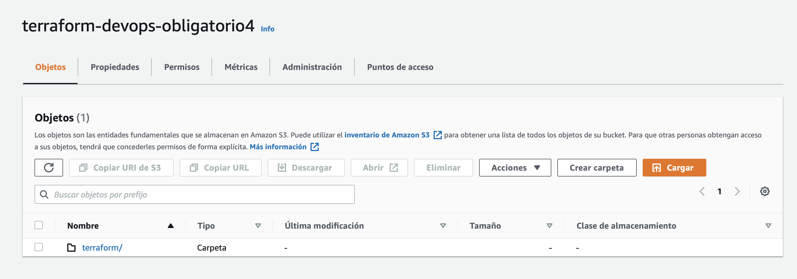


- **Se declaran los providers a utilizar para crear la infraestructura junto con el bucket s3**

```terraform
# Terraform Block -c1-versions.tf
terraform {
  #required_version = "~> 0.14.6" # which means >= 0.14.6 and < 0.15
  required_providers {
    aws = {
      source  = "hashicorp/aws"
      version = "~> 3.0"
    }
   
  }

  # Adding Backend as S3 for Remote State Storage
  backend "s3" {
    bucket = "terraform-devops-obligatorio"
    key    = "terraform/terraform.tfstate"
    region = "us-east-1"
  }
}


# Provider Block
provider "aws" {
  region  = var.aws_region   //"us-east-1"
  profile = "default"
}
```
- **El Código puede encontrarse en**: [c1-versions.tf](https://github.com/devopsort/terraform/blob/Prod/c1-versions.tf)


**- Debe crearse un par de claves ssh, descargar el pem y colocarlo en la carpeta "private-key", configurar el mismo en el archivo de variables y terraform.tfvars.**

```terraform
# Variables Generales -variables.tf
variable "aws_region" {
  description = "Region in which AWS resources to be created"
  type        = string
}

variable "terraform-key" {
    description = "AWS ssh Key"
    type = string
    sensitive = true
}

variable "Ec2-ssh-key" {
    description = "SSH Key"
    type = string
    sensitive = true
}
```

```terraform
# Variables Generales -terraform.tfvars
aws_region = "us-east-1"
terraform-key = "keyssh-EC2-prueba"
Ec2-ssh-key = "private-key/keyssh-EC2-prueba-insite.pem"
````
**El Codigo puede encontrarse en**:

  - [variables.tf](https://github.com/devopsort/terraform/blob/Prod/variables.tf)

  - [.tfvars](https://github.com/devopsort/terraform/blob/Prod/terraform.tfvars)


### La infraestructura consta de tres ambientes conformados por:

- Un VPC con diferentes SubNet para los ambientes:
  - SubNet Infraestructura: una zona de disponibilidad.
  - SubNet Developer dos zonas a y b
  - SubNet Testing dos zonas a y b 
  - SubNet Prod cuatro zonas a, b, c y d.

   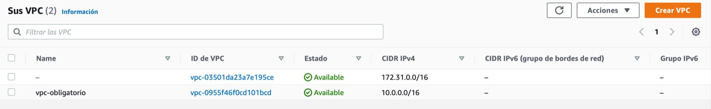
   
   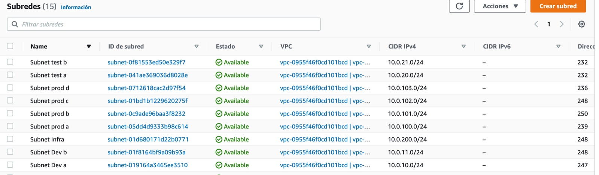

  **El Código se puede encontrar en**: [c2-vpc.tf](https://github.com/devopsort/terraform/blob/Prod/c2-vpc.tf)

- **Segurity groups para cada ambiente.**
    - En la SubNet de infra se permite el acceso por el puerto 22(SSH) y al Jenkins por el 8080.
    - En las subnet de los ambientes se les permiten todos los puertos desde dentro de la infraestructura, desde fuera por internet solo 80 y 443, para publicar los         servicios.


  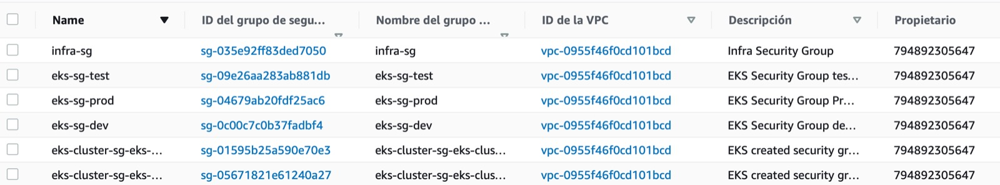


   **El Código puede encontrase en**: [c4-sg.tf](https://github.com/devopsort/terraform/blob/Prod/c4-sg.tf)

- **Clusters EKS, uno para cada ambiente**:
  - eks-cluster-dev 
  - eks-cluster-test
  - eks-cluster-prod
    
  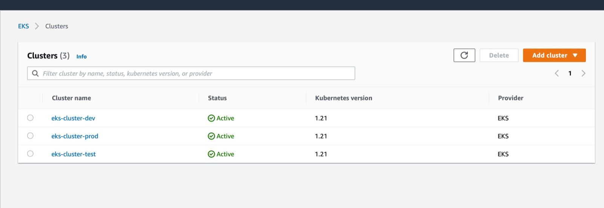
  
  Los mismos estan parametrizados en el archivo de variables.tfvars y eksCluster.tf asi como los recursos a cada uno.

  **tfvars**:[ .tfvars](https://github.com/devopsort/terraform/blob/Prod/terraform.tfvars) 

  **ekscluster**:[ ekscluster.tf](https://github.com/devopsort/terraform/blob/Prod/eksCluster.tf)


- Una Instancia EC2 "JenkinsDockerTF" con el SecurityGroup **"sg-obl-infra"** y la SubNet **"Subnet Infra"**
  - Esta instancia cumplira la función de administrar Jenkins, kubectl, aws_cli y argo_cli.
  - Se le instalaran todas las herramientas necesarias mediante remote-exec
  
  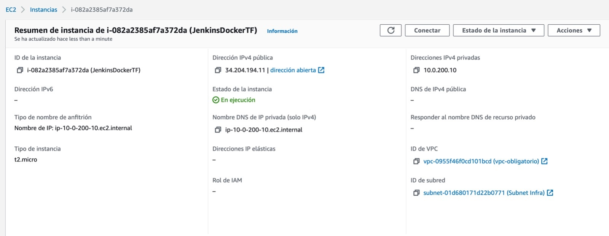
  
  
  
    **El Código puede encontrarse en**: [Jenkins.tf](https://github.com/devopsort/terraform/blob/Prod/Jenkins.tf)
  
 

- Un conjunto de repositorios ECR para almacenar las imagenes buildeadas de cada microservicio

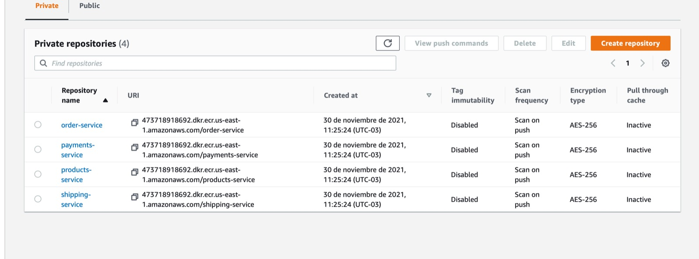

   **- El Código puede encontrarse en**: [ECR.tf](https://github.com/devopsort/terraform/blob/Prod/ECR.tf)


**El siguiente diagrama es como esta constituida la infrastructura**:


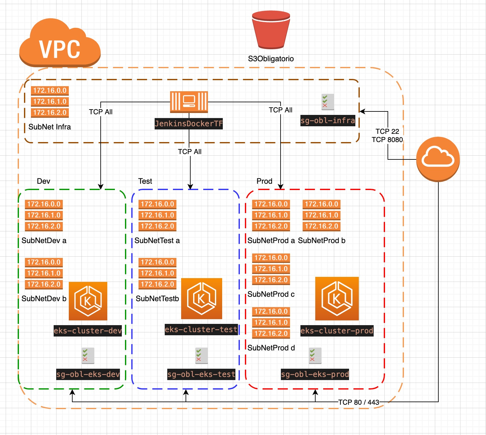


# CI/CD:computer:

### El siguiente diagrama es como está constituido el CI/CD:
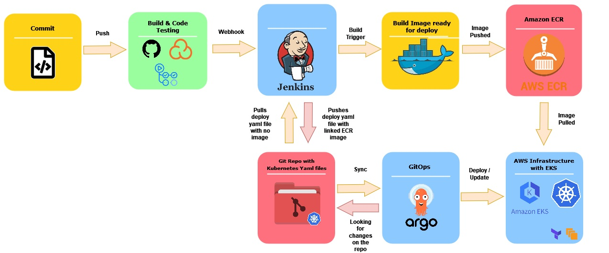


- Al realizarse un push en algun repositorio de los microservicios, comienzan a ejecutarse los Jobs de las github actions que consisten en:

  - Levantar un contenedor ubuntu-latest y sincronizar repositorio
  - Instalar las dependencias JDK11 necesarias para la ejecución
  - Realizar un cache del package con las dependencias de SonarCloud
  - Realizar un cache del package con las dependencias de Maven
  - Realizar Build y Análisis

  **Aquí se puede encontrar a modo de ejemplo el workflow del microservicio *orders***:[ WorkFlow_File](https://github.com/devopsort/orders-service-example/actions/runs/1483697667/workflow)


- Simultáneamente mediante un Webhook, Jenkins detecta el push y realiza las siguientes tareas:

  - Realiza un clonado del repositorio git del microservicio
  - Realiza el build de una imagen docker con el microservicio listo para desplegarse
  - Pushea la imagen hacia el repositorio ECR de Amazon
  - Realiza un pull del un yaml base(*kind deployment*) dentro del repositorio argocd correspondiente al microservicio
  - Edita el yaml agregando el link hacia la imagen del microservicio almacenado en ECR
  - Pushea el yaml editado bajo el nombre "deployment.yml" hacia el repositorio argocd correspondiente

  **El pipeline correspondiente al jenkins puede encontrarse en**:[ Pipeline](https://github.com/devopsort/Pipelines/blob/main/Jenkinsfile-Obligatorio)
  
  **El yaml base del microservicio *orders* a modo de ejemplo**: [ yaml_base](https://github.com/devopsort/argocd_orders-service-example/blob/Prod/deployment.yml_ORIGINAL)


## Configuración del Jenkins

Luego de instalada la Infraestructura nos logueamos al EC2 de Jenkins para proceder con la configuración del mismo, lo primero es buscar el `initialAdminPassword` que solicita el Jenkins para inicializarlo, ver imagen:

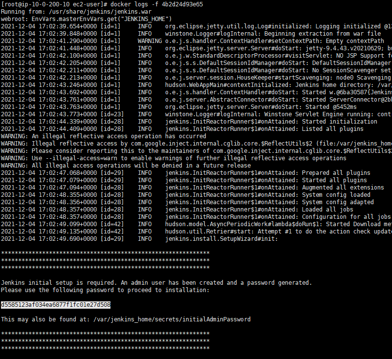

 Especificamos la clave mostrada anteriormente en la nuestra interfaz Jenkins, ver imagen:

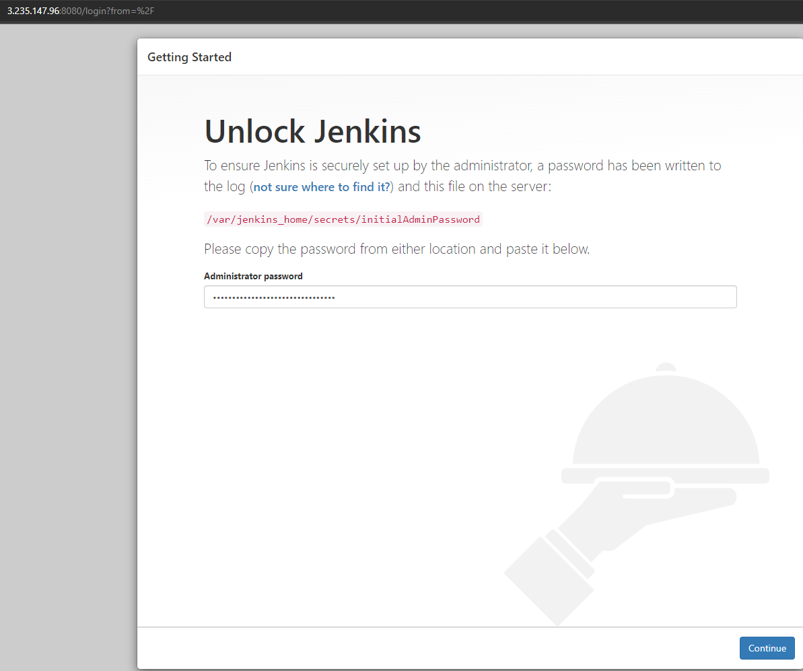


Luego procedemos a la instalación de las dependencias iniciales que nos específica el Jenkins por defecto y a la configuración del usuario `Admininistrador` que se va a usar, ver imagen:

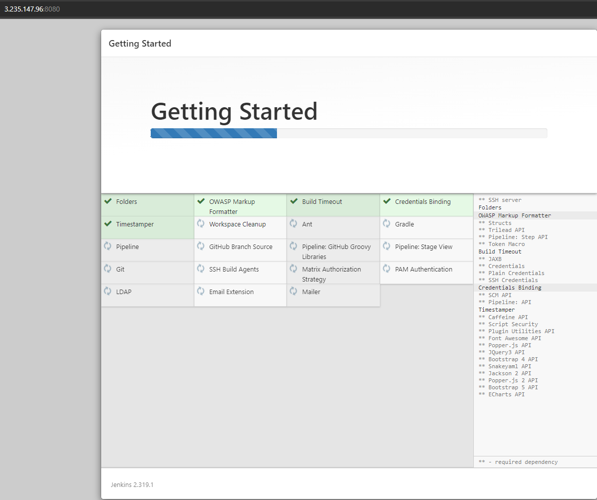
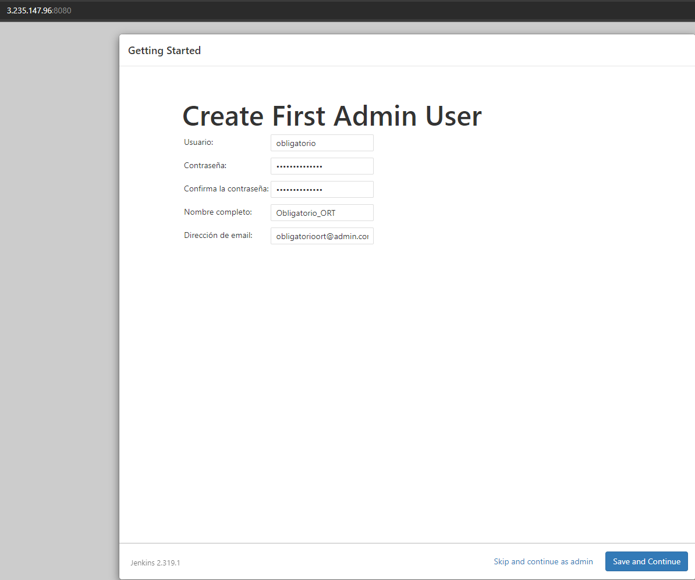

Y como bien se muestra en la siguiente imagen, se puede mostrar que la instalación terminó exitosamente y que esta operativo y listo para trabajar.

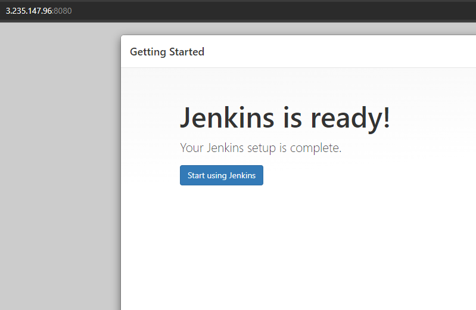

Para el despliegue y la compilación del los microservicios configuramos las diferentes tareas para gestionar el trabajo.
En el siguiente Job capturamos el evento cuando se realice el push por parte de desarrollador en las ramas del git.
Primeramente especificamos el repositorio del microservicio:

**Nota:** Se toma como ejemplo el repositorio del microservicio **products**.

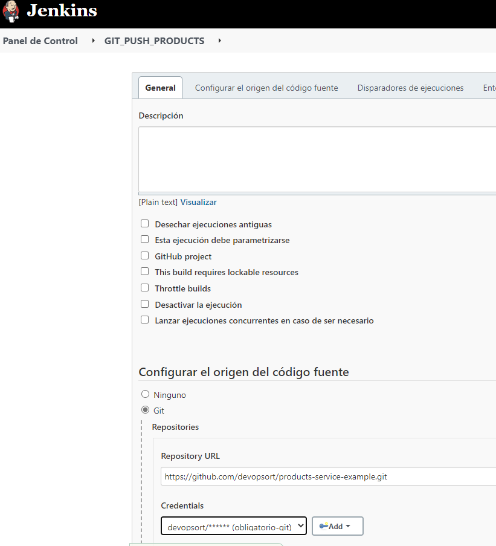

Además guardamos en un archivo variable el repo y la rama de la cual se realiza el commit y llamamos a otro Jobs que va ser el encargado de hacer el armado de la imagen, el push para el ECR de AWS y el despliegue en los K8S de los diferentes microservicios.

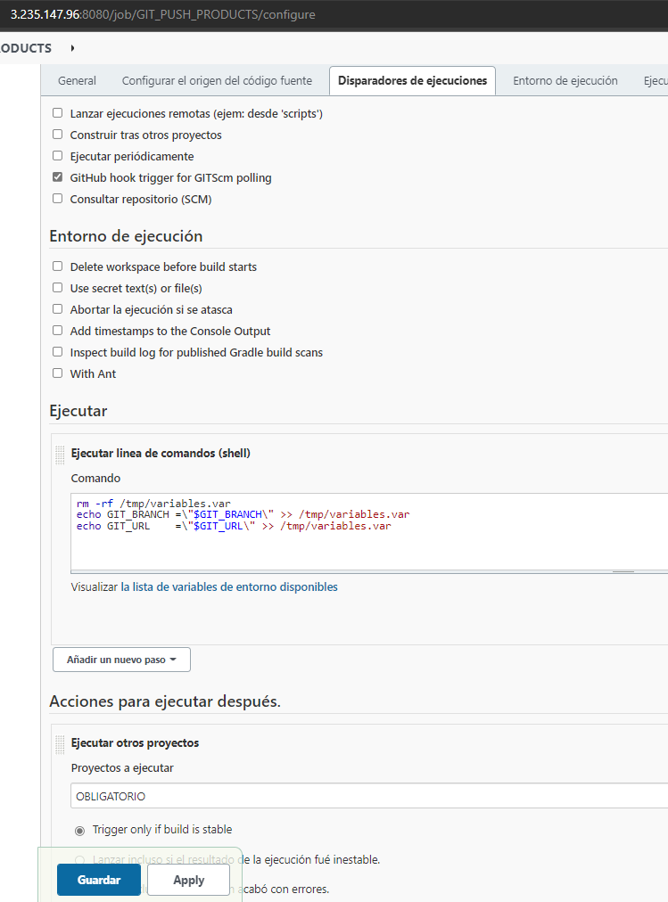

Especificación del jobs **OBLIGATORIO**:

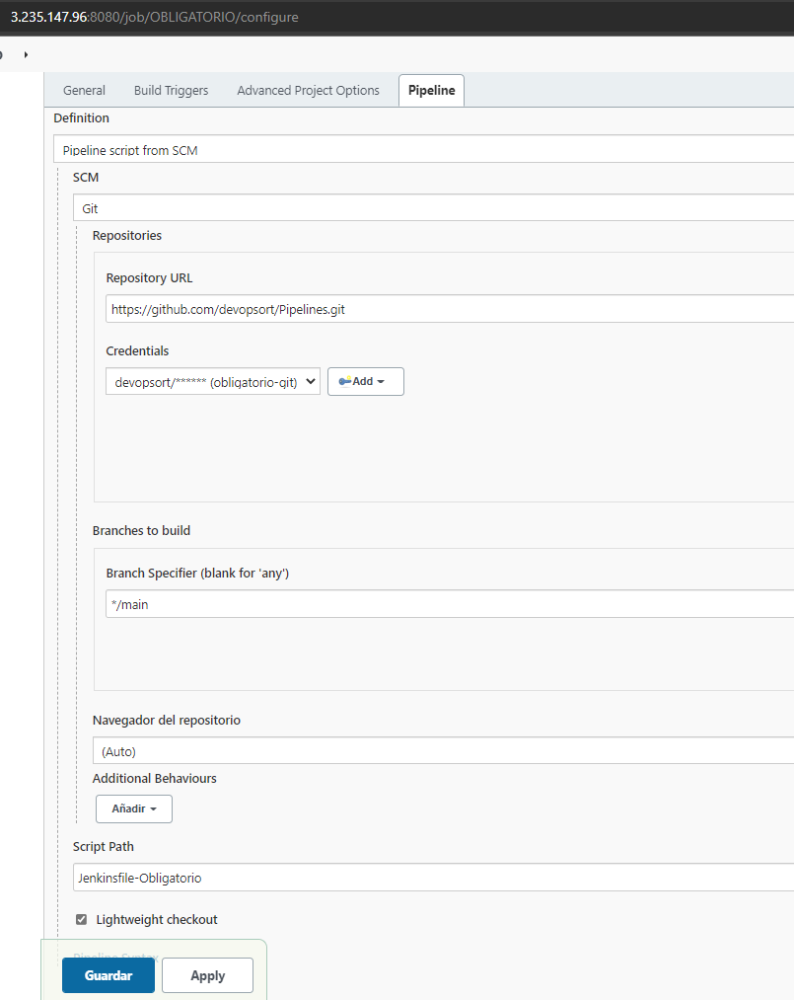

Al final de la configuración las tareas quedan de la siguiente manera:

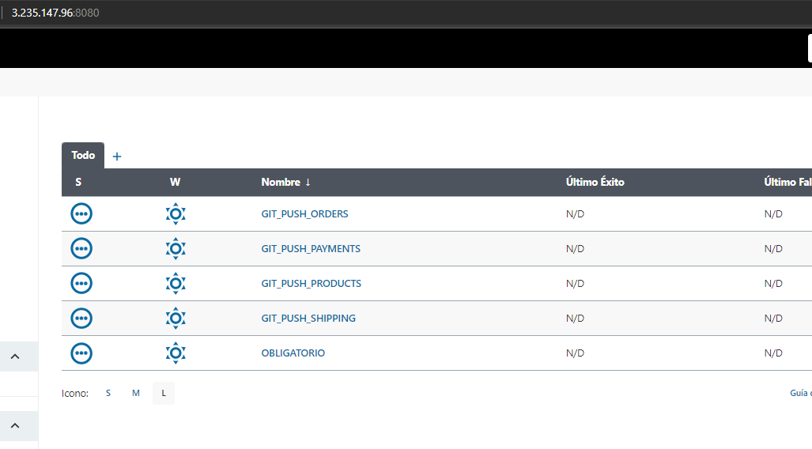

Por ultimo se debe especificar en el las configuraciones del git la url del jenkins para asociarlo, ver imagen:

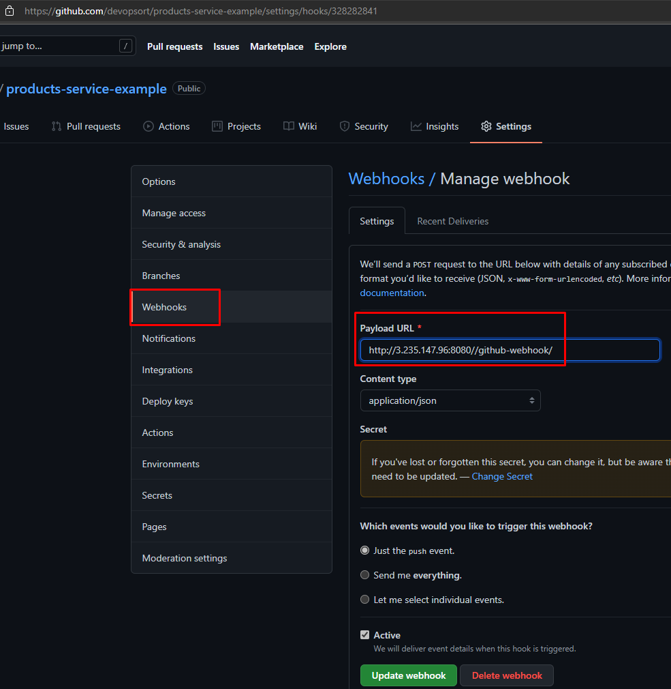

**Repositorio donde especificamos el archivo Jenkinsfile-Obligatorio:** 

 - [JenkinsFile](https://github.com/devopsort/Pipelines.git)

Para conectar el EC2 del Jenkins con el git para realizar el push para el repositorio, debemos especificar lo siguiente:

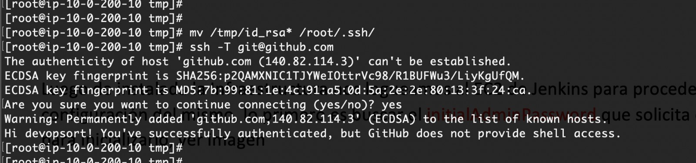


